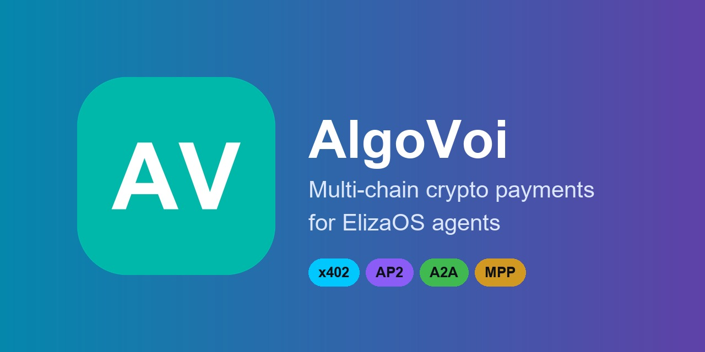

# @algovoi/plugin-elizaos

[](LICENSE)
[](https://github.com/elizaos-plugins/registry)

> Multi-chain agent-to-agent (A2A) crypto payments for [ElizaOS](https://elizaos.ai) agents.



Lets your Eliza agent **ask for, verify, and poll fiat-denominated crypto payments** that settle as stablecoins or native assets across **7 chains** — without holding any crypto, keys, or fiat.

| What | How |
|---|---|
| **Ask for a payment** | Agent generates a hosted checkout URL the payer opens in any browser |
| **Verify a payment** | Agent confirms an on-chain tx satisfies the expected amount, receiver, and binding |
| **Poll a checkout** | Agent checks whether a previously-issued token has been paid |

Settlement is direct on-chain customer-wallet → merchant-wallet via [AlgoVoi](https://algovoi.co.uk), the only live A2A-compliant crypto payment gateway as of 2026-04-26.

## Why this plugin

- **Non-custodial.** AlgoVoi never holds funds. Your agent doesn't need a wallet, a private key, or any fiat custody — only an API key.
- **7 chains, one interface.** Algorand, VOI, Hedera, Stellar, Base, Solana, Tempo — agent says "GBP", AlgoVoi handles the chain selection.
- **4 payment protocols.** x402 (HTTP 402 micropayments), MPP (IETF), AP2 (Google Agentic Payments), and Google A2A v0.3.
- **Stablecoin-first.** USDC across Algorand, VOI, Hedera, Stellar, Base, Solana, Tempo. Native asset support where the chain has it.
- **No new SDK deps.** Plugin is a thin HTTP wrapper around the public A2A endpoint at `https://api1.ilovechicken.co.uk/.well-known/agent.json`.

## Install

```bash
pnpm add @algovoi/plugin-elizaos
# or
npm install @algovoi/plugin-elizaos
# or
yarn add @algovoi/plugin-elizaos
```

## Get an API key

Free tier (testnet) at [dash.algovoi.co.uk/signup](https://dash.algovoi.co.uk/signup).
Mainnet activation requires KYC; the free trial covers your first $1,000 of mainnet payment volume across all chains.

## Configure

Set environment variables (or pass via the runtime's settings):

```env
ALGOVOI_API_KEY=algvk_live_...        # required — from dash.algovoi.co.uk
ALGOVOI_API_BASE=https://api1.ilovechicken.co.uk   # optional, this is the default
ALGOVOI_DEFAULT_NETWORK=algorand_mainnet           # optional, default
ALGOVOI_DEFAULT_CURRENCY=GBP                       # optional, default
```

## Use it in an Eliza character

```ts
import { algovoiPlugin } from "@algovoi/plugin-elizaos";

const character = {
  name: "PayAgent",
  bio: "I'm an AI assistant that can collect and verify crypto payments.",
  plugins: [algovoiPlugin],
  // ... rest of your character config
};
```

A complete character JSON is in [`examples/payments-character.json`](examples/payments-character.json).

## Actions

The plugin registers three actions on the Eliza runtime:

### `CREATE_PAYMENT_REQUEST`

Create a hosted checkout link for a fiat amount.

**Triggers:** "create a payment request for £9.99", "invoice 50 USD", "ask for $20 on solana".

**Returns:** `{ token, checkout_url, status, expires_at, chain, amount_microunits }`.

### `VERIFY_PAYMENT`

Verify an on-chain transaction satisfies a payment.

**Triggers:** "verify tx ABC123 on algorand_mainnet for token uW9MJN-abc123", "did the user pay for resource X".

**Returns:** `{ verified: true|false, access_token, error? }`. The `access_token` is a JWT your agent can use to gate downstream calls.

### `CHECK_PAYMENT_STATUS`

Poll a previously-issued checkout token.

**Triggers:** "is checkout X paid?", "check status of token Y".

**Returns:** `{ token, status: "active" | "paid" | "expired" | "cancelled", redirect_url }`.

## End-to-end example

```ts
import { algovoiPlugin, AlgoVoiClient } from "@algovoi/plugin-elizaos";

// Or use the underlying client directly:
const client = new AlgoVoiClient({
  ALGOVOI_API_KEY: process.env.ALGOVOI_API_KEY!,
  ALGOVOI_API_BASE: "https://api1.ilovechicken.co.uk",
  ALGOVOI_DEFAULT_NETWORK: "algorand_mainnet",
  ALGOVOI_DEFAULT_CURRENCY: "GBP",
});

// 1. Create a checkout
const checkout = await client.createCheckout({
  amount: 9.99,
  currency: "GBP",
  label: "Premium content access",
  preferred_network: "algorand_mainnet",
  redirect_url: "https://your-app.example.com/thanks",
});

console.log(`Pay here: ${checkout.checkout_url}`);
console.log(`Token to poll: ${checkout.token}`);

// 2. Poll until paid
let status = checkout.status;
while (status === "active") {
  await new Promise((r) => setTimeout(r, 10_000));
  const result = await client.checkStatus({ token: checkout.token });
  status = result.status;
}

// 3. Or — verify a known tx_id directly
const verified = await client.verifyPayment({
  network: "algorand_mainnet",
  tx_id: "7K9X...PQR",
  token: checkout.token,
});
if (verified.verified) {
  console.log(`Access granted. JWT: ${verified.access_token}`);
}
```

## Supported networks

| Chain | Mainnet | Testnet | Stablecoin | Native |
|---|---|---|---|---|
| Algorand | ✅ | ✅ | USDC | ALGO |
| VOI | ✅ | ✅ | — | VOI |
| Hedera | ✅ | ✅ | USDC | HBAR |
| Stellar | ✅ | ✅ | USDC | XLM |
| Base | ✅ | ✅ (Sepolia) | USDC | ETH |
| Solana | ✅ | ✅ (Devnet) | USDC | SOL |
| Tempo | ✅ | ✅ | USDC | — |

## Discovery

The plugin connects to a Google A2A v0.3 agent. You can inspect AlgoVoi's full agent card at:

```bash
curl https://api1.ilovechicken.co.uk/.well-known/agent.json
```

## Security

- AlgoVoi is non-custodial — funds settle direct customer→merchant on a public blockchain
- Your tenant API key is the only secret; rotate it via the dashboard
- Compliance binder, security disclosure, and full policy library at [algovoi.co.uk/AlgoVoi/compliance.html](https://algovoi.co.uk/AlgoVoi/compliance.html)
- Vulnerability disclosure: [security@algovoi.co.uk](mailto:security@algovoi.co.uk) / [/.well-known/security.txt](https://algovoi.co.uk/.well-known/security.txt)

## Contributing

PRs welcome. Open an issue first for substantial changes. The plugin's contract is intentionally narrow — it wraps the A2A endpoint and nothing more — so most enhancements belong in the upstream gateway, not here.

## License

MIT — see [LICENSE](LICENSE).

## Links

- AlgoVoi platform: [algovoi.co.uk](https://algovoi.co.uk)
- Docs: [docs.algovoi.co.uk](https://docs.algovoi.co.uk)
- A2A integration: [docs.algovoi.co.uk/protocols/a2a](https://docs.algovoi.co.uk/protocols/a2a)
- ElizaOS: [elizaos.ai](https://elizaos.ai)
- Plugin registry: [github.com/elizaos-plugins/registry](https://github.com/elizaos-plugins/registry)
